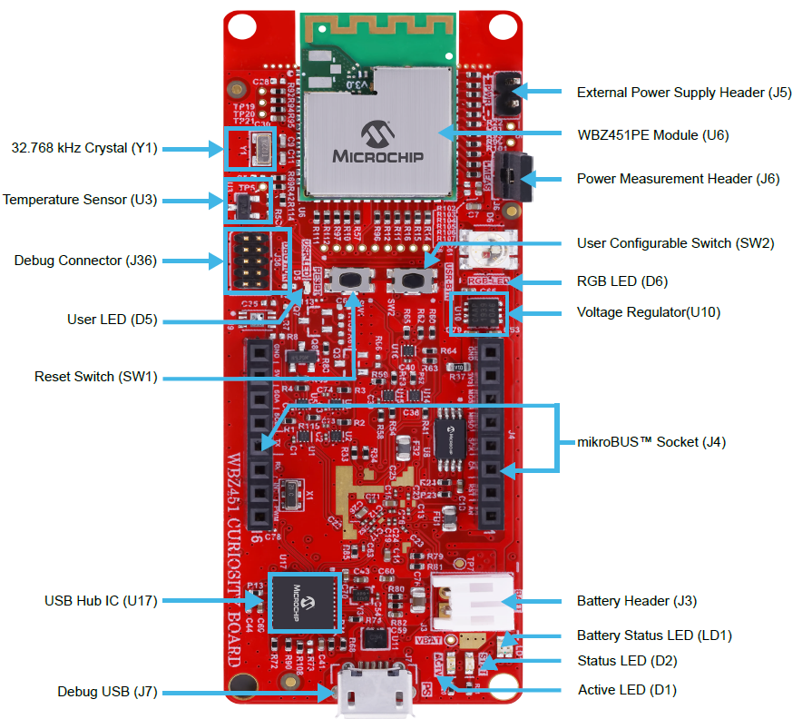

# wbz_c_pattern_project
 * This project is used to explore concepts learned in the Udemy course "Embedded C Programming Design Patterns" by Martin Schroder

# Contents Summary

| Folder              | Description                                                |
|:--------------------|:-----------------------------------------------------------|
| firmware            | embedded project source                                    |
| media               | png, etc...                                                |
| tools               | MISRA check script, etc...                                 |

# Hardware Setup

* WBZ451 Curiosity board
* USB micro B cable
    * connect this to the WBZ451 Curiosity USB connection
    * Provides debugger
    * Provides USB-to-UART prints statements from the WBZ451 UART @ 115200 BAUD 8N1

# Block diagram

# Pinout

# MCC Configuration Project Graph

# Hardware operation

## Sensors:

* MCP9700A Linear Active Thermistor Integrated Circuit outputs an analog voltage. The temperature coefficients are scaled to provide a 1°C/bit resolution for an 8-bit ADC with a reference voltage of 2.5V. When measuring relative change in temperature from +25°C, an accuracy of ±1°C (typical) can be realized from 0°C to +70°C.
    * This voltage is fed into port PB6 which is Analog Channel 2 (AN2) of the 12b SAR ADC on the WBZ451

## LEDs:
* User LED D5 Blue: PB7
* RGB  LED D6 Red: PB0
* RGB  LED D6 Green: PB3
* RGB  LED D6 Blue: PB5

## Switches:
* Reset Switch SW1 connects to NMCLR to reset the processor
* User Button SW2: PB4

## UART:
* The board has a single USB connection to a host which goes through an onboard USB2512B hub. The hub provides connection to an emedded debugger, as well as a MCP2200 USB-to-serial converter connected to the following pins:
    * RX:  PA6, SERCOM0_PAD1
    * TX:  PA5, SERCOM0_PAD0
    * RTS: PA4, SERCOM0_PAD3
    * CTS: PA3, SERCOM0_PAD2

# Firmware Operation

## 4C Diagrams

## IDE and compiler settings

* VSCode with MPLAB Extensions
* XC32 v4.45
* Part Packs
    * CMSIS 5.9.0
    * WBZ451_DFP 1.5.243
* Harmony package versions:
    * csp 3.23.0
    * core 3.15.5
    * dev_packs ??

# Unit Tests

* This project was created using Test Driven Development. The unit test framework selected is CPPUTest
    * Unit tests are executed on the X86/64 processor using the gcc compiler
    * Executing unit tests
* Code coverage is enabled in CPPUtest using the gcov utility which is part of the gcc tool suite
    * Executing code coverage
    * 
    * Output is placed in the ??? directory. The top level file is called "GcovCoverageResults.html". From this file you can click into the individual module reports
    * 
